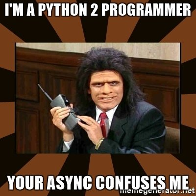

# Async for Python 2 Programmers

An introduction to async starting from Python 2 syntax and concepts.

[Video](https://www.youtube.com/watch?v=jJzHMu2H6cw) of presentation.

To run slide show from Jupyter, see instructions for [RISE](https://damianavila.github.io/RISE/index.html).

To simply view the code, open *async.html* in browser.

